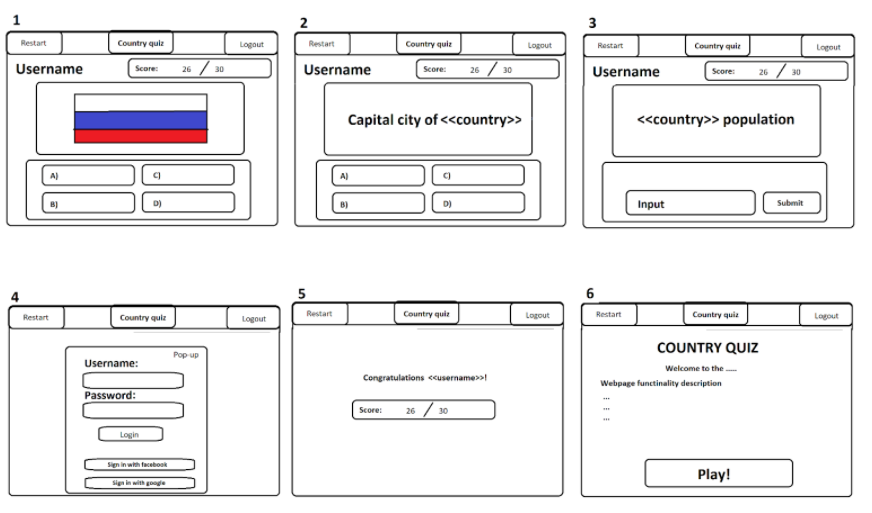

https://github.com/michalmokros/country-quiz

Country quiz is a game where you can test your geography knowledge.

When you land on the main page, first you have to login through various possible ways (facebook, github, …). The main page also contains info about the game and Play! Button. (Picture 6). After clicking the button the game starts for you. You can always restart the game or logout and login as another user through another API. (Picture 4)
The game consists of numerous questions, where each question consists of three levels.
In the first level you have to correctly guess the country by its flag, you have four options in the form of buttons, only one answer is correct. (Picture 1)

If you succeed in the first level, you move to another question. There you have to correctly guess the name of the capital city of the country from the first level. You again have four possible answers.(Picture 2)
If you guess the second question correctly you move to the last level, where you have to input the number of citizens for the country from the first level. The number is then checked against the correct value, and points are awarded accordingly: full points if you are within 10% of the correct guess, ... (Picture 3)
If you fail to answer the first or second question in the same level you failed that level of question, you keep the points you got for the level and you move to the next question where you start again from first level.

During the whole game a score is kept for the player. You are rewarded with points for each correct answer.
For the first level you can get 1 point.
For the second level you can get 2 points.
For the third level you can get 1/2/3 points, depending on how accurate your guess is.
When the game ends, the player runs out of questions, the end screen is shown with all the acquired points. (Picture 5)

